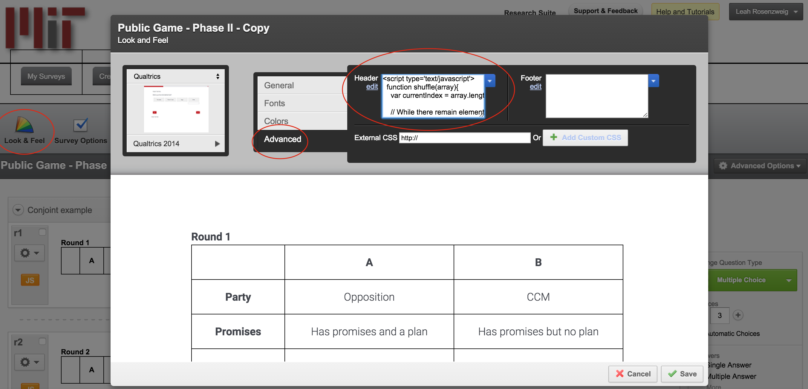
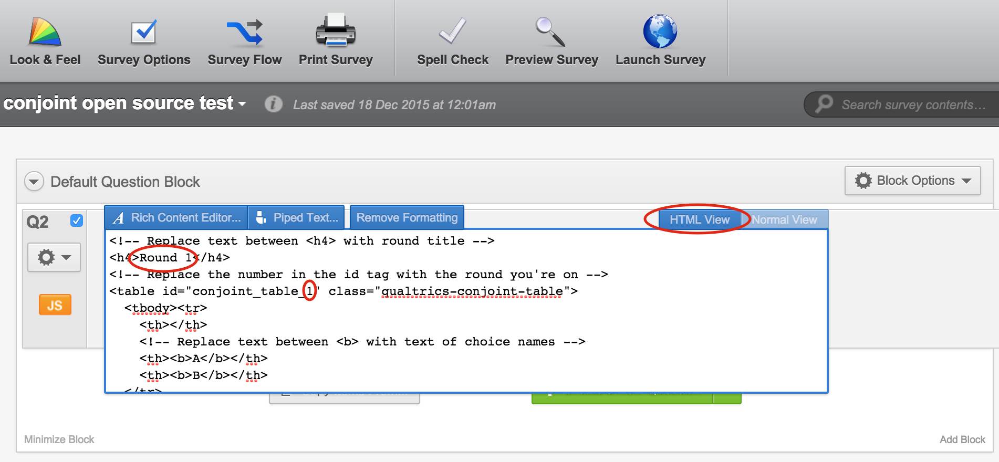
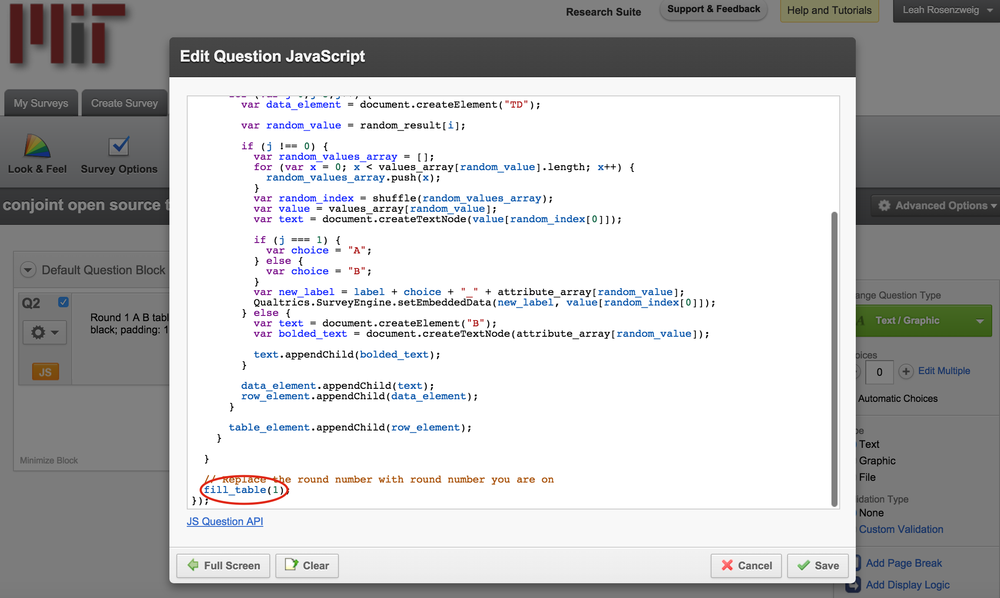
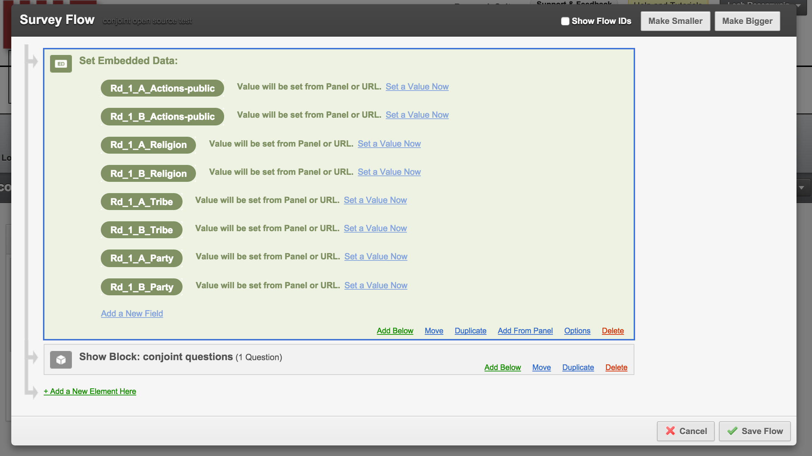

# Conjoint para Qualtrics Offline

Genera tareas de elección para análisis conjoint que pueden utilizarse en la aplicación de Qualtrics offline. Útil para realizar encuestas usando esta aplicación en campo sin acceso confiable a internet/datos. 

Lea más sobre nuestras herramientas offline de conjoint <a href="https://static1.squarespace.com/static/5410fc5ae4b0b9bdbd0cde82/t/56b164909f7266d4a9c52d59/1454466192633/Meyer_Rosenzweig_2016.pdf" target="_blank">aquí</a>.

## Cómo usar

En este repositorio encontrará tres archivos de código (“qualtrics_look_and_feel.html”, “qualtrics_random_tables.js” y “qualtrics_tables.html”). Todos estos archivos son necesarios para generar tablas aleatorias de pares de perfiles conjoint en la aplicación offline de Qualtrics.

### Personalizar atributos y niveles conjoint y aleatorizar el orden de los atributos

El código en el archivo code/qualtrics_look_and_feel.html es lo primero que querrá editar para personalizar el código según su diseño específico. Este código configura los atributos, niveles y aleatoriza el orden de los atributos que se muestran a cada encuestado. Esta aleatorización ocurre una vez y luego permanece consistente en todas las rondas de presentación de los pares de tareas de elección.

En la línea 22 verá var attribute_array que define el array de sus atributos conjoint. Deberá reemplazar los nombres de atributo de marcador de posición con los suyos. También puede eliminar o agregar nombres de atributo según la cantidad de atributos en su diseño conjoint. 

En la línea 25, var values_array define los niveles de cada atributo. Nuevamente, puede personalizar el array para tener más de dos niveles por atributo. Por ejemplo, para los niveles de religión, en el primer array, en lugar de solo dos niveles podría agregar otro: ['Christian', 'Muslim', 'Jewish']. Asegúrese de que la cantidad de arrays de niveles coincida con el número total de atributos, de lo contrario recibirá un mensaje de error. 

Si desea usar imágenes en lugar de texto para los valores de los atributos, comente la línea 25 y descomente la línea 29. Reemplace las URLs predeterminadas con las URLs de las imágenes que desea usar en su encuesta. Asegúrese también de actualizar el archivo code/qualtrics_random_tables.js para usar imágenes también, como se describe a continuación.

**Nota:** Las imágenes solo funcionarán con una conexión en línea. Si desea usarlas offline, deberá almacenar las imágenes localmente y luego usar la ruta de las imágenes almacenadas localmente en lugar de URLs.

Una vez que haya adaptado el código del archivo code/qualtrics_look_and_feel.html, cópielo y pegue el código copiado en la sección 'Look and Feel' de su encuesta de Qualtrics. Haga clic en el botón “Look & Feel” en la parte superior izquierda cuando esté editando la encuesta. En la ventana emergente haga clic en “Advanced” y luego pegue el código en el cuadro de texto Header. Luego guarde.

### Insertar tablas conjoint como preguntas

Copie todo el código encontrado en el archivo code/qualtrics_tables.html. En cada pregunta de Qualtrics donde desee que aparezca una tabla conjoint, pegue el código copiado en la vista HTML del cuadro de texto de la pregunta. Después de pegar el código, asegúrese de reemplazar el texto del título de la ronda con el número de ronda correcto (o con lo que desee etiquetar el cuadro). Independientemente de cómo titule los cuadros conjoint, asegúrese de cambiar el número de la tabla conjoint en la línea 4. También puede personalizar las etiquetas en la parte superior de las tablas para reflejar las opciones que está presentando a las personas. Actualmente, las opciones se presentan como “A” y “B”, pero si desea personalizar esto, puede cambiar fácilmente el código en las líneas 8 y 9. 

Antes de copiar el código encontrado en code/qualtrics_random_tables.js, si desea usar imágenes en lugar de texto para los valores de los atributos, asegúrese de comentar la línea 28 y descomentar las líneas 30-33. Si desea usar ambos, actualice `values_array` para incluir ambos.

A continuación, copie todo el código encontrado en el archivo code/qualtrics_random_tables.js. Agregue un bloque JavaScript a la misma pregunta donde agregó el código html de la tabla. Haga clic en el botón de engranaje debajo del número de pregunta y luego seleccione “Add JavaScript...” Para este código puede seleccionar lo que ya esté escrito en el cuadro de texto y eliminar todo. Luego pegue este código.

Después de pegar el código, asegúrese de ajustar fill_table(#) en la parte inferior (línea 53) para reflejar en qué ronda se está pegando este JavaScript. Este número debe coincidir con el número usado en la etiqueta id html de la tabla conjoint anterior. Por ejemplo, asegúrese de que la segunda tabla conjoint con el segundo conjunto de perfiles cambie a “fill_table(2)” en la parte inferior del código JavaScript. Haga clic en guardar.

Este código aleatoriza los niveles de cada atributo. En este punto, la aleatorización utiliza probabilidades iguales para cada nivel de atributo. Siéntase libre de contribuir a este código y permitir probabilidades desiguales. 

### Configurar la captura de datos conjoint

Ahora que ha configurado el conjoint para aleatorizar niveles y generar tablas de perfiles, necesita asegurarse de que Qualtrics registre qué perfiles ve cada encuestado. Para incrustar variables para que Qualtrics las registre, haga clic en el botón Survey Flow. Haga clic en “+ Add a new element here” y luego seleccione “Embedded Data”. Asegúrese de mover este elemento de modo que los datos incrustados sean el primer elemento en el flujo de la encuesta (es decir, antes de todos sus bloques de preguntas).

El formato que tomará su variable incrustada será Rd_número de ronda_A/B_nombre del atributo. Por ejemplo, Rd_1_A_Religion registrará el nivel de religión aleatorizado del Candidato A en la ronda 1. Nota: el nombre del atributo debe estar escrito correctamente y coincidir exactamente con el nombre del atributo proporcionado en el archivo code/qualtrics_look_and_feel.html en var attribute_array. Para guardar los perfiles conjoint de todas las rondas, necesitará incrustar una variable que corresponda a cada elección (aquí A y B) para cada atributo y cada ronda.

Si desea cambiar el nombre de las elecciones de “A” y “B” a algo más, puede cambiar el código JavaScript (code/qualtrics_random_tables.js) en las líneas 31 y 33. Nota: si cambia “A” y “B” en el código JavaScript, DEBE incrustar nombres de variables que correspondan a sus elecciones personalizadas. Por ejemplo, si quisiera registrar las elecciones como “Policy1” y “Policy2”, mis variables incrustadas se verían así: “Rd_1_Policy1_Tax” y “Rd_1_Policy2_Tax”.

### Probar el código

Es posible que note que al probarlo en su computadora, el orden de los atributos no cambia o los cambios que realiza no aparecen. Esto se debe a que el código usa almacenamiento del navegador. Necesitará borrar este almacenamiento cada vez que ejecute una prueba para que funcione correctamente. Recomendamos usar navegación privada (también conocida como modo incógnito) al probar. Este modo borrará automáticamente cualquier almacenamiento, por lo que obtendrá una prueba nueva cada vez que la ejecute. Si no desea usar navegación privada o no está disponible, deberá borrar sus datos de navegación después de cada ejecución. Puede averiguar cómo hacerlo en la configuración de su navegador. Esto se hace automáticamente si usa las aplicaciones móviles o de tableta de Qualtrics Offline, por lo que no es necesario realizar cambios si usa estas aplicaciones. 

## Limitaciones conocidas y mejoras futuras

* La aleatorización actualmente solo se realiza con pesos iguales
* El código actualmente no tiene en cuenta restricciones entre niveles de atributo (por ejemplo, si desea evitar que un perfil de inmigrante tenga occupation = doctor y education level = none).
* Actualmente no existe un mecanismo para que Qualtrics registre el orden de los atributos que se presenta a cada encuestado, pero dado que el orden de los atributos se aleatoriza entre encuestados, el orden de presentación no debería importar.
* Supone que tiene dos alternativas de las cuales se espera que los encuestados seleccionen
* No genera automáticamente variables incrustadas de Qualtrics.

## Cómo contribuir

* Consulte el último master para asegurarse de que la funcionalidad no haya sido implementada o el error corregido
* Consulte el seguimiento de problemas para asegurarse de que alguien ya no lo haya solicitado y/o contribuido
* Realice un fork del proyecto
* Inicie una rama de funcionalidad/corrección de errores
* Realice commit y push hasta que esté satisfecho con su contribución

## Licencia

Liberado bajo la Licencia MIT. Consulte [LICENSE](LICENSE) o http://opensource.org/licenses/MIT para más información.

## Otros proyectos de código abierto para Conjoint

* Si también busca ejecutar experimentos conjoint offline con papel/PDF, consulte nuestro otro proyecto de código abierto [aquí](https://github.com/acmeyer/Conjoint-PDF-Generator-App)

## Créditos		

* <a href="http://www.leahrrosenzweig.com" target="_blank">Leah Rosenzweig</a>		
* <a href="http://alexcmeyer.com" target="_blank">Alex Meyer</a>		
* Para citaciones: <a href="https://static1.squarespace.com/static/5410fc5ae4b0b9bdbd0cde82/t/56b164909f7266d4a9c52d59/1454466192633/Meyer_Rosenzweig_2016.pdf" target="_blank">“Meyer & Rosenzweig 2016”</a>
