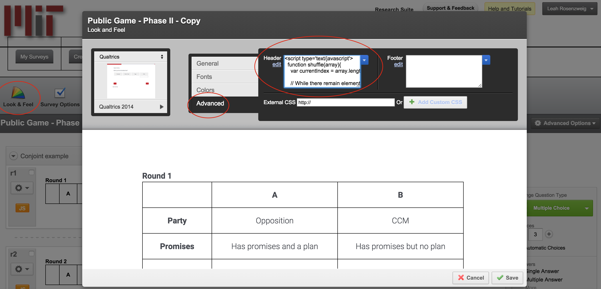
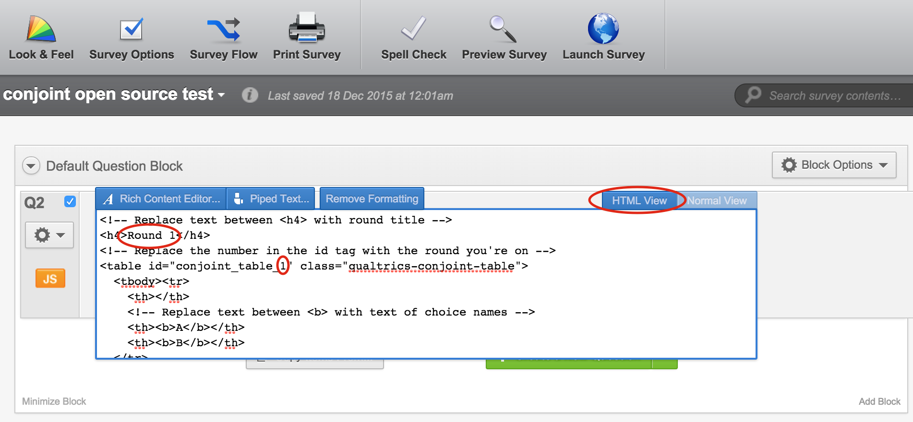
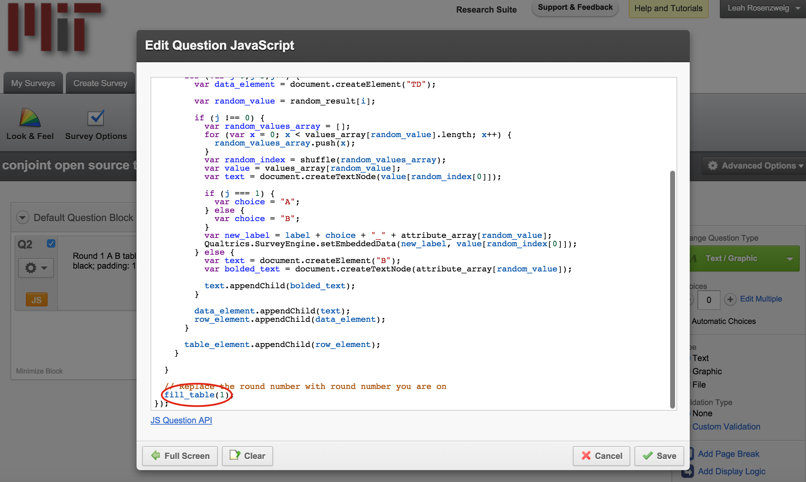
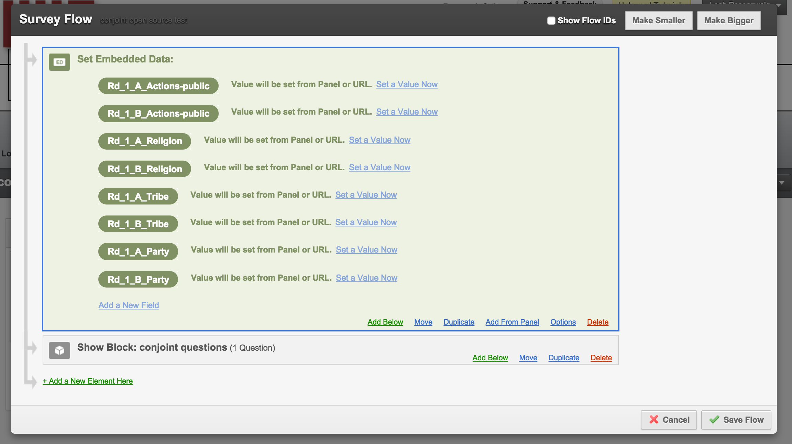

# Conjoint for Qualtrics Offline

Produces conjoint analysis choice tasks that can be used in the Qualtrics offline application. Useful for running surveys using this application in the field without reliable internet/data access. 

## How to Use

In this repository you will find three code files (“qualtrics_look_and_feel.html”, “qualtrics_random_tables.js” and “qualtrics_tables.html”). All of these files are required to produce randomized tables of conjoint profile pairs in Qualtrics’ offline application.

### Customize Conjoint Attributes and Levels & Randomize Attribute Order

The code in the code/qualtrics_look_and_feel.html file is the first thing you will want to edit to customize the code to your specific design. This code sets up the attributes, levels, and randomizes the order of the attributes shown to each respondent. This randomization occurs once and then remains consistent throughout all of the rounds of the presentation of the choice task pairs.

In line 22 you will see var attribute_array which defines the array of your conjoint attributes. You should replace the placeholder attribute names with yours. You can also delete or add attribute names depending on the number of attributes in your conjoint design. 

In line 24 the var values_array defines the levels of each attribute. Again, you can customize the array to have more than two levels per attribute. For example, for the religion levels, the first array, instead of only two levels you could add another: ['Christian', 'Muslim', 'Jewish']. Just make sure that the number of level arrays matches the total number of attributes, otherwise you will receive an error message. 

Once you have adapted the code from the code/qualtrics_look_and_feel.html file copy it and paste the copied code into the 'Look and Feel' section of your Qualtrics survey. Click on the “Look & Feel” button on the top left when you’re editing the survey. In the pop-up window click “Advanced” and then paste the code into the Header text box. Then save.

### Insert Conjoint Tables as Questions

Copy all the code found in the code/qualtrics_tables.html file. In each Qualtrics question you want a conjoint table to appear, paste the copied code in the HTML view portion of the question's text box. After pasting the code, make sure to replace the round title text with the correct round number (or anything you you want to label the box with). Regardless of how you title the conjoint boxes, be sure to change the conjoint table number in line 4. You can also customize the labels at the top of the tables to reflect the choices you are presenting to people. Currently the choices are presented as “A” and “B” but if you would like to customize this you can easily change the code in lines 8 and 9. 

Next, copy all the code found in the code/qualtrics_random_tables.js file. Add a JavaScript block to the same question where you added the table html code. Click on the gear button under the question number and then select “Add JavaScript...” For this code you can select what’s already written in the text box and delete everything. Then paste this code in.

After you’ve pasted the code be sure to adjust the fill_table(#) at the bottom (line 53) to reflect what round this JavaScript is being pasted into. This number should match the number used in the conjoint table html id tag above. For example, be sure that the second conjoint table with the second set of profiles is changed to “fill_table(2)” at the bottom of the JavaScript code. Click save.

This code randomizes the levels of each attribute. At this point the randomization uses equal probabilities for each attribute-level. Feel free to contribute to this code and allow for unequal probabilities. 

### Setup Capturing Conjoint Data

Now that you’ve set up the conjoint to randomize levels and produce profile tables you need to make sure that Qualtrics will record what profiles each respondent sees. To embed variables for Qualtrics to record click the Survey Flow button. Click “+ Add a new element here” and then select “Embedded Data”. Be sure to move this element such that the embedded data is the first element in the survey flow (i.e. before all your question blocks).

The format your embedded variable will take is Rd_round number_A/B_attribute name. For example, Rd_1_A_Religion will record the Candidate A’s randomized religion level in round 1. Note: the attribute name needs to be spelled correctly and exactly match the attribute name provided in the code/qualtrics_look_and_feel.html file in the var attribute_array. To save the conjoint profiles from all rounds you will need to embed a variable that corresponds to each choice (here A and B) for every attribute and every round.

If you would like to rename the choices from “A” and “B” to something else you can change the JavaScript code (code/qualtrics_random_tables.js)  in lines 31 and 33. Note: if you change “A” and “B” in the Javascript code you MUST embed variable names that correspond to your customized choices. For example, if I wanted to record choices as “Policy1” and “Policy2” my embedded variables would instead look like: “Rd_1_Policy1_Tax” and “Rd_1_Policy2_Tax”.

### Testing the Code

You may notice when testing on your computer, the order of attributes doesn't change or changes you make don't appear. This is because the code uses browser storage. You will need to clear this storage each time you run a test in order for it to work properly. We recommend using private browsing (aka incognito mode) when testing. This mode will automatically clear any storage, so you will get a fresh test each time you run it. If you do not want to use private browsing or do not have it available, then you will have to clear your browsing data after each run. You can find out how to do this in your browser's settings. This is done automatically if using the Qualtrics Offline mobile or tablet apps, so no need to make any changes if you are using these apps. 

## Known Limitations & Future Improvements

* Randomization is currently only done with equal weights
* The code currently does not account for restrictions among attribute levels (for example if you wanted to prevent an immigrant profile from having occupation = doctor and education level = none).
* There is not currently a mechanism of having qualtrics record the order of the attributes that is presented to each respondent, but since the order of attributes is randomized across respondents the order of presentation should not matter.
* Assumes you have two alternatives from which respondents are supposed to select
* Does not automatically produce Qualtrics embedded variables.

## Contributing

* Check out the latest master to make sure the feature hasn't been implemented or the bug hasn't been fixed yet
* Check out the issue tracker to make sure someone already hasn't requested it and/or contributed it
* Fork the project
* Start a feature/bugfix branch
* Commit and push until you are happy with your contribution

## License

Released under the MIT License. See [LICENSE](LICENSE) or http://opensource.org/licenses/MIT for more information.

## Other Open Source Projects for Conjoint

* If you also are looking to run conjoint experiments offline with paper/PDFs, see our other open source project [here](https://github.com/acmeyer/Conjoint-PDF-Generator-App)

## Credits

* [Leah Rosenzweig](http://www.leahrrosenzweig.com)
* [Alex Meyer](http://alexcmeyer.com)
* For citations: “Meyer and Rosenzweig 2015”
